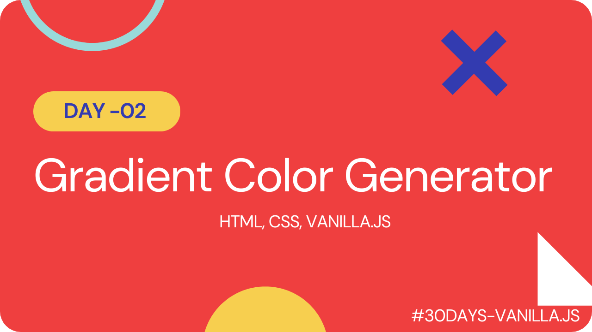

# Gradient Color Generator

The Gradient Color Generator App is a web-based tool built with HTML, CSS, and vanilla JavaScript. It allows users to generate custom gradient color combinations for their web design projects quickly and easily.

The app features a user-friendly interface with color pickers, a preview pane. Once the user has created their desired gradient, they can copy the CSS code and paste it into their project.

#### [Live Link]()

#### [Youtube Demo]()

 

