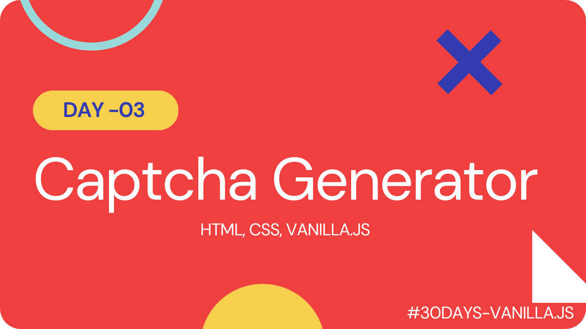

# Captcha Generator

A captcha generator project using HTML, CSS, and vanilla JavaScript that creates randomized challenges to distinguish between humans and bots, preventing spam and automated attacks on websites.

#### [Live Link](https://captchas-generator.netlify.app/)

#### [Youtube Demo](https://youtu.be/qwZwqMG0FwE)

 

