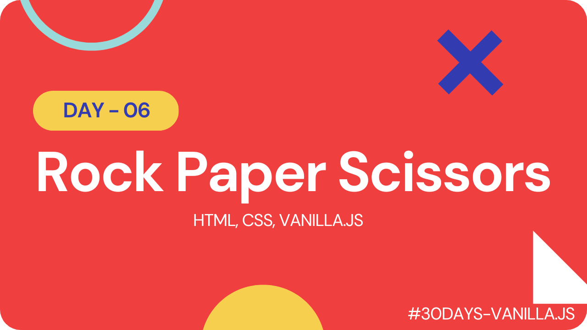

# Rock Paper Scissors Game

This is a simple implementation of the classic game "Rock Paper Scissors" using HTML, CSS, and JavaScript. The game allows you to play against the computer.

## How to Play

To play the game, simply choose one of the three options (rock, paper, or scissors) by clicking on the corresponding button. The computer will then randomly choose its own option, and the winner will be determined based on the following rules:

- Rock beats scissors
- Scissors beats paper
- Paper beats rock

## Try it Out

#### [Live Link](https://rps-vanillajs.netlify.app/)

#### [Youtube Demo](https://youtu.be/C5CkGn6bYrI)

 

