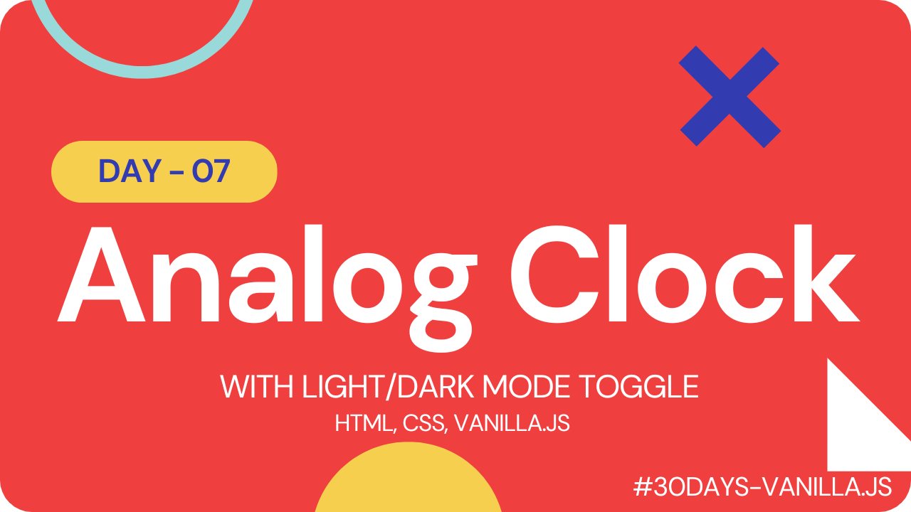

# Analog Clock with Light/Dark Mode Toggle

This project is a stylish and modern analog clock featuring a glassmorphism effect and customizable dark and light modes. It was created using HTML, CSS, and JavaScript and is perfect for adding a touch of sophistication to any website or app.

## Check it Out

#### [Live Link]()

#### [Youtube Demo](https://youtu.be/cJeAOuZ8Yr8)

 

