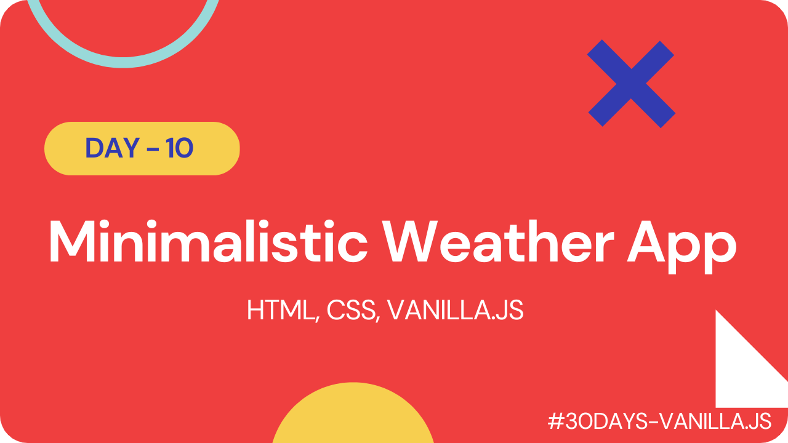

# Minimalistic Weather App

This is a simple weather app that allows users to enter a city name and get the current weather conditions for that location. The app was built using HTML, CSS, and JavaScript, and utilizes the OpenWeatherMap API to retrieve weather data.

## Check it Out

#### [Live Link](https://mini-weather-webapp.netlify.app/)

#### [Youtube Demo](https://youtu.be/iC4nyAo0gSM)

## Usage

To use the app, simply enter the name of a city in the search box and click the "Search" button. The app will retrieve the current weather conditions for that location and display them in the weather box.

## Installation

To install the app, simply clone this repository to your local machine and open corresponding index.html file in a web browser.

`git clone https://github.com/ShubhamSingh03/30Days-VanillaJs`

### API Key

This app utilizes the [OpenWeatherMap API](https://openweathermap.org/api) to retrieve weather data. To use the app, you will need to obtain an API key from OpenWeatherMap and add it to the config.js file.

`export const API_KEY = "your-api-key";`

 

