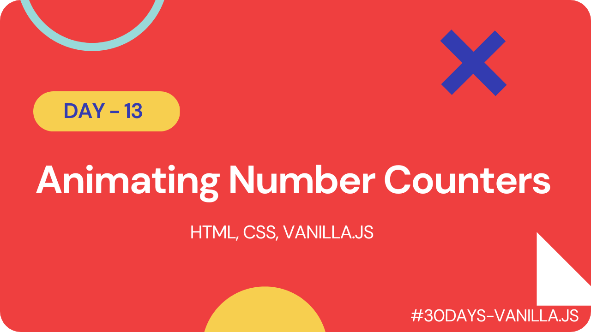

# Animating Number Counters

This is a simple project that demonstrates how to animate number counters using HTML, CSS, and JavaScript. The project includes a basic HTML file, a CSS file, and a JavaScript file that work together to create the animation.

## Check it out

#### [Live Link]()

#### [Youtube Demo]()

 

